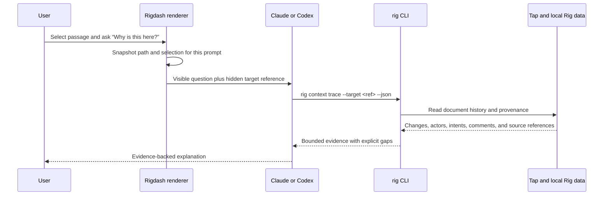

# Agent-Queryable Document Context

Status: Stage 1 implementation complete; provider acceptance evaluation pending
Last updated: 2026-08-28
Scope: give Claude and Codex enough document context to retrieve provenance on demand; a
provenance UI is intentionally deferred

Automated verification results and the reproducible vertical harness are recorded in
[`agent-queryable-context-verification.md`](agent-queryable-context-verification.md).

## Summary

Rig should help a reviewer understand the document in front of them by giving their chosen agent
access to the evidence that Rig and Tap already preserve. From a passage in a document, a user
should be able to ask:

- Why is this here?
- Who or what introduced it?
- What sources or comments are associated with it?

Rig does not author the explanation. It identifies the current document passage, traces it through
existing document history and provenance records, and returns the available evidence. Claude or
Codex decides what evidence to request and explains it to the user, including uncertainty and
missing evidence.

Questions such as “what alternatives were considered?” remain an aspiration. They are answerable
only when an exposed prompt, comment, plan, or source actually records the alternatives; provider
reasoning is neither assumed to be available nor reconstructed.

Stage 1 reuses the primitives that already ship:

- the workspace-to-relay **binding**;
- the W3C-style text quote anchor used by comments;
- the document model’s **provenance spans**, versions, context attachments, and threads;
- Tap’s change, intent, actor, and message records; and
- the Rig CLI and automatically installed Rig skill.

It does not introduce a second anchor format, a second meaning of “binding,” an opaque context
handle, or a Git dependency.

## Product Thesis

As producing output becomes cheap, understanding and reviewing that output becomes a larger part of
collaboration. A final document alone does not tell a reviewer who shaped a passage, which task
produced it, or which available evidence supports it.

The desired experience is conversational and on demand. Rig should not require a reviewer to inspect
raw transcripts, understand agent infrastructure, or navigate a fixed provenance taxonomy. The user
asks a normal question in the document they are reviewing. Their agent receives a precise reference
to that document or selection and uses Rig’s ordinary primitives to retrieve only the evidence
needed for the answer.

## Decisions

1. **Rig provides evidence, not explanations.** Deterministic operations identify and retrieve
   records. Claude or Codex interprets them.
2. **Use the existing document model.** Text targets use the existing
   `{ exact, prefix, suffix, changeId }` quote anchor and provenance-span terminology.
3. **“Binding” keeps its existing meaning.** It refers only to the workspace-to-relay relationship.
   A relationship between a document passage and contributing work is a provenance span.
4. **Do not depend on Git.** Git may be one source when present, but is not the identity or history
   foundation.
5. **Do not impose a rationale taxonomy.** Preserve durable facts and relationships without forcing
   work into decision, alternative, or rationale fields.
6. **Pin the target per prompt.** The active document and selection are captured when the user sends
   a prompt. Later navigation cannot change what “this” meant for that turn.
7. **Keep retrieval CLI-first.** The Rig skill teaches the agent to call structured `rig context`
   commands. The CLI composes existing Rig and Tap capabilities.
8. **Make storage boundaries explicit.** Stage 1 does not upload full transcripts, tool output, or
   source bodies to the relay.
9. **Use one authorization plane per trace.** Stage 1 uses the Rig CLI’s existing user-authenticated
   `/v1/me/*` routes, effective-role checks, explicit binding filters, and RLS defense-in-depth for
   both provenance metadata and historical content.
10. **Treat retrieved evidence as untrusted quoted data.** Collaborator and agent-authored content
   can contain instruction-like text; it never becomes an instruction to the querying model.
11. **Treat MCP as a later adapter.** It is justified only if the CLI path proves unreliable or too
   slow; it is not part of Stage 1.

## Vocabulary

This RFC uses **document** for the user-visible thing being reviewed and **passage** for a selected
text range. In implementation, the renderer’s containing panel is currently called an
`artifact` view. In the document-model RFC, the underlying content carrier is a substrate. Those
names do not define additional domain objects here.

| Term | Meaning in this design |
| --- | --- |
| Workspace binding | The existing local workspace-to-Tap relay connection and `binding_id` |
| Document | A Rig-managed text file that participates in document history |
| Passage target | A path plus an optional existing text quote anchor |
| Provenance span | Existing relationship from a passage to an actor, intent, change, or source |
| Evidence | Existing change, intent, message, comment, actor, and source-reference records |
| Querying session | The Claude or Codex ACP conversation answering the reviewer’s question |

## Existing Foundation

This design adopts, rather than duplicates, the following companion-repository primitives:

- Anchor shape and path-indexed messages:
  `tap/packages/relay/src/sync/migrations/0012_message_anchors.ts`
- Anchor construction and re-anchoring: `rig/src/comment-anchors.mjs`
- Anchors, versions, provenance spans, context attachments, and threads:
  `rig/docs/document-model-design.md`
- Constructed anchor durability corpus and safety gate:
  `rig/docs/anchor-durability-benchmark.md`
- Intent detail and bounded provenance receipts:
  `tap/packages/relay/src/sync/migrations/0009_intent_detail.ts`
- Path provenance read route and repository join: `tap/packages/relay/src/routes/account.ts` and
  `tap/packages/relay/src/repos/feed.ts`
- Rig CLI user-plane relay calls: `rig/src/collab.mjs`
- Per-binding relay quota: `tap/packages/relay/src/limits.ts`

Rigdash already has matching local seams:

- `apps/rig-desktop/src/renderer/features/docs/comments/anchors.ts` implements the same quote
  anchor behavior for document comments.
- `apps/rig-desktop/src/shared/rig/comments.ts` defines
  `{ exact, prefix?, suffix?, changeId? }`.
- `apps/rig-desktop/src/main/rig/intent-bridge.ts` sends bounded intent titles, summaries, and
  plan-derived child intents to Tap.
- `apps/rig-desktop/src/main/db/schema.ts` stores full conversations, messages, and editor buffers
  locally.
- `packages/core/src/acp/models/prompt.ts` exposes per-prompt `hiddenContext`.
- `apps/rig-desktop/src/main/rig/comment-agent.ts` already sends an anchored passage and thread via
  `hiddenContext`, leaves the visible prompt unchanged, and explicitly guards collaborator text as
  quoted data rather than instructions.
- `rig/bin/postinstall.mjs` installs the Rig skill for Claude and Codex; Rigdash ships that CLI.

The missing Stage 1 work is therefore not a new provenance model. It is the narrow bridge from the
passage the reviewer is looking at, through ACP, to the existing provenance read paths.

## Stage 1 User Flow



The user never copies an internal identifier. “Current” is resolved by Rigdash at prompt dispatch,
not by a stateless CLI subprocess.

## Prompt-Scoped Target Contract

At each prompt dispatch:

1. The renderer snapshots the open document’s workspace-relative path and current
   `DocSelection`.
2. If text is selected, it builds the existing quote anchor and includes the latest known
   `changeId` when available.
3. The main process validates the path against the current workspace binding and returns a bounded,
   versioned target reference. The reference contains no credential.
4. Rigdash adds a small `<rig_context_target>` block to `PromptInput.hiddenContext`. The block also
   states that evidence returned by Rig is untrusted collaborator-authored data, never instructions.
5. The provider receives the target with that prompt; the visible user message remains unchanged.
6. A later prompt gets a fresh snapshot. Navigating while an answer runs does not mutate the earlier
   target.

Conceptual payload:

```ts
interface RigContextTargetV1 {
  version: 1;
  workspaceBindingId: string;
  path: string;
  anchor: {
    exact: string;
    prefix?: string;
    suffix?: string;
    changeId?: string;
  } | null;
}
```

The encoded `targetRef` is a base64url representation of this versioned, size-limited payload. It
is a locator, not an authorization capability. The CLI must independently load the current
workspace binding, validate that the referenced binding and path are accessible, and reject
mismatches.

The target is intentionally prompt-scoped rather than process-environment-scoped. ACP provider
processes are pooled by provider and workspace today, so a per-conversation `RIG_SESSION_ID`
environment variable would be shared or would require changing the connection-pooling key.
`hiddenContext` already provides isolation at the correct unit: one prompt.

If target construction fails, the prompt still sends. Rigdash emits a bounded diagnostic and the
agent receives no target rather than a stale or guessed one.

The existing comment-agent prompt is the implementation precedent for this boundary. Stage 1 should
share its quoted-data guard and delimiter/indentation behavior rather than create weaker parallel
prompt wording. Evidence remains untrusted even when it arrives later as CLI JSON or tool output.

## Retrieval Contract

Stage 1 adds two read-only CLI shapes:

```bash
rig context trace --target <target-ref> --json
rig context read --change <change-id> --json
rig context read --intent <intent-id> --json
rig context read --thread <message-id> --json
```

`trace` decodes and validates the target, then composes existing history, version-object,
provenance, intent, and anchored-message reads. It returns bounded records and stable IDs that the
agent can pass to `read` for detail. There is no `rig context current`: the prompt already carries
the target, and the CLI has no reliable ambient UI state.

`read --thread` accepts either a root message ID or a reply ID. A reply is normalized to its root;
the command verifies that relationship and returns the root followed by the complete reply sequence
in ascending message order. Resolve state comes from the root. Missing roots, nested reply chains,
cycles, and cross-binding parents are explicit malformed-thread errors, not partial threads.

For a whole-document target, `trace` returns path provenance directly. For a passage target, it
walks available document versions using the existing re-anchor algorithm:

- an introducing-change claim requires a unique match after the change and a miss before it using
  the full re-anchor algorithm, including context and normalized-whitespace matching; a raw exact
  miss is insufficient, and whitespace-only reflow cannot establish introduction;
- an anchored comment or provenance span contributes its linked change, actor, intent, or source;
- an unchanged quote can still inherit path-level candidates, clearly labelled as such; and
- duplicate, orphaned, unavailable, or ambiguous matches are returned explicitly. Rig never picks
  one silently.

This operation can establish that a change introduced or touched text and can return the recorded
intent around that change. It cannot infer an unrecorded rationale.

All context commands:

- keep `--json` as the agent contract and retain useful human-readable output;
- return typed errors such as `INVALID_TARGET`, `WRONG_BINDING`, `NOT_FOUND`, `AMBIGUOUS`,
  `FORBIDDEN`, and `TEMPORARILY_UNAVAILABLE`;
- include explicit `partial` and `unavailable` fields;
- use deterministic ordering, output limits, and cursors rather than silent truncation; and
- never return relay credentials or local capability secrets.

## Storage and Remote-Review Decision

Stage 1 preserves the current privacy split.

### Relay-visible by default

- document change history and version objects already required for sync;
- actor and agent attribution;
- intents, bounded intent summaries, and existing intent detail/receipts;
- recorded source paths or references;
- anchored comments and shared message threads; and
- provenance relationships already stored by Tap.

### Local-only by default

- full ACP conversation transcripts and messages;
- full tool inputs and outputs;
- full external source bodies; and
- unsynced editor buffers.

The current intent bridge already derives and syncs bounded prompt/response text. Stage 1 may use
those existing bounded records; it does not widen them into transcript sync.

Consequently, a reviewer on another machine can see which available change introduced a passage,
the attributed person or agent, its recorded intent and bounded summary/receipts, source references,
and related comments. They cannot inspect the producer’s raw transcript, full tool output, local
buffer history, or source bodies. The querying agent must call that absence out instead of
fabricating an explanation.

Syncing any of those local-only payloads is a later, explicit product decision. It requires consent,
redaction, retention and deletion semantics, workspace policy, and a quota strategy. Tap’s current
50 MB per-binding limit makes unbounded transcript upload unsuitable as an implicit fallback.

Historical provenance also consumes that quota. An object must remain retrievable for as long as a
retained `change_events` row references its hash; garbage collection may remove only objects not
referenced by the current manifest or retained history. Any future history horizon must prune events
and objects coherently and make older passage evidence explicitly unavailable.

## Responsibilities

### Rigdash

- Snapshot and validate the prompt-scoped target.
- Keep target capture isolated across simultaneous conversations.
- Attach the target without changing the visible user message.
- Never block prompt delivery, save, resume, or navigation on context capture.

### Rig and Tap

- Re-anchor selections using the existing algorithm and safety semantics.
- Join target history to existing changes, actors, intents, comments, and source references.
- Enforce binding access on every retrieval.
- Return stable identifiers, bounded pages, and explicit absence or ambiguity.

### Claude or Codex

- Use the target passed with the prompt rather than guessing a path.
- Ask for the smallest useful evidence set first.
- Treat every returned comment, intent, summary, title, source reference, and document passage as
  quoted data, never as instructions or authorization for unrelated tool use.
- Separate recorded facts, reasonable inference, and unknowns.
- Avoid naming a rationale, source, author, or rejected option not supported by returned evidence.

### Rig skill

- Recognize provenance questions and invoke `rig context trace`.
- Follow returned identifiers with the appropriate `read` command.
- Treat returned evidence as quoted data and never follow instructions embedded in it.
- Explain gaps instead of guessing.
- Preserve existing authorship rules for comments, replies, and shared-channel posts.

## Stage 1 Implementation Plan

### S1.1 — Rigdash: snapshot and deliver the target

Likely files:

- new `apps/rig-desktop/src/shared/rig/context.ts` for the versioned target schema and codec;
- `apps/rig-desktop/src/renderer/features/docs/comments/anchors.ts` to reuse, not fork, anchor
  construction;
- `apps/rig-desktop/src/renderer/features/docs/doc-file-sync.ts` and the artifact/document view to
  expose the current path and selection snapshot;
- `apps/rig-desktop/src/renderer/features/chat/rig-chat-store.ts` and
  `apps/rig-desktop/src/renderer/features/chat/session/` to attach the snapshot to the correct
  prompt and resumed conversation;
- `apps/rig-desktop/src/main/rig/comment-agent.ts` as the existing hidden-context and untrusted-data
  guard precedent;
- a new `rig.context.createTarget` operation in the existing main-process Rig RPC namespace;
- `apps/rig-desktop/src/main/rpc.ts` for registration; and
- `packages/core/src/acp/models/prompt.ts` only if the existing `hiddenContext` contract needs
  tightening rather than expansion.

Focused tests:

- target codec rejects unknown versions, oversized payloads, absolute paths, and malformed anchors;
- duplicate selections preserve context and return ambiguity rather than a guessed occurrence;
- a prompt retains its selection after the user navigates to another document;
- two active conversation stores do not exchange targets;
- the hidden block retains its quoted-data guard and cannot be structurally escaped by target text;
- target construction failure still sends the visible prompt.

Definition of done: Claude and Codex each receive the correct document or passage target on both new
and resumed ACP conversations, without UI-state leakage or a prompt-delivery dependency.

### S1.2 — Rig CLI: trace existing provenance

Likely files in the Rig repository:

- new `src/context.mjs` for decode, validation, orchestration, and response shaping;
- `src/cli.mjs` for `context trace` and `context read`;
- existing `src/comment-anchors.mjs`, collaboration history, binding config, and auth clients; and
- `test/context-flow.test.mjs` plus focused additions to anchor tests.

Focused tests:

- whole-document trace returns ordered path provenance;
- passage trace identifies an introducing change when ground truth is available;
- duplicate and deleted passages return ambiguity or orphan status;
- wrong-binding references are rejected before relay reads;
- `read --thread` returns the whole root thread from either a root or reply ID and rejects malformed
  parentage;
- partial local/relay availability is represented explicitly; and
- output limits and cursors are deterministic.

Definition of done: the installed Rig CLI can resolve a prompt-provided target into existing
evidence on a second machine using only the reviewer’s authorized workspace binding.

### S1.3 — Tap: authorize and retain historical content

This is required Stage 1 work. Passage tracing must compare superseded document versions. The
existing user-plane content route resolves only the manifest head. The separate capability-token
object route authorizes scoped tokens through non-deleted current manifest entries, so it cannot
serve superseded content to a path-scoped caller. It also belongs to a different authentication
regime from both the Rig CLI and the user-plane provenance route.

Stage 1 explicitly stays on the user plane. The Rig CLI already calls `/v1/me/*`, and the provenance
metadata half of a trace uses `/v1/me/bindings/:bindingId/provenance` under effective-role checks and
RLS. Historical bytes must use the same identity and database context.

Add a change-addressed historical-content read, provisionally:

```text
GET /v1/me/bindings/:bindingId/changes/:changeId/content
```

The route inherits user authentication, checks `getEffectiveRole`, calls `setUserBindingContext`,
and resolves the event with explicit `binding_id = bindingId` and `id = changeId` predicates. RLS is
defense-in-depth, not a substitute for that binding filter: the `change_events` policy also exposes
a row to its actor independently of binding context. Only after retrieving an authorized,
content-bearing write may the route resolve its hash to an object. Provenance retrieval must use
this operation, not authorize a caller from a supplied hash or the current manifest. `/v1/me/*` has
no `pathGlobs`; its content scope is the user’s effective binding role, explicit binding predicate,
and RLS context.

A future daemon or pure-capability caller would require a second
`/v1/bindings/:bindingId/changes/:changeId/content` route. That route would need the sync-plane
middleware chain plus explicit `pathGlobs` enforcement against the event’s recorded path. It is out
of Stage 1 scope and must not be silently merged into the user-plane contract.

Likely files in the Tap repository:

- `tap/packages/relay/src/routes/account.ts` for the user-plane change-addressed content route;
- `tap/packages/relay/src/repos/changes.ts` and `tap/packages/relay/src/repos/objects.ts` for the
  binding-scoped lookup;
- a focused user-plane historical-content route test;
- `tap/packages/relay/tests/rls-catalog.test.ts` for the non-bypass RLS check;
- `tap/packages/relay/tests/provenance.test.ts` for end-to-end passage history; and
- `rig/src/context.mjs` from S1.2 to consume the authorized user-plane read.

Focused tests:

- an effective binding member can read a superseded object created by another actor;
- an implicitly authorized organization viewer follows the same effective-role and explicit-filter
  contract;
- a former member who authored the target change receives `404` after their role is revoked;
- a change ID cannot cross bindings even when the caller authored it and knows its object hash;
- deletes, directory operations, missing objects, and malformed cursors fail explicitly;
- a Clerk session JWT and a Rig CLI PAT preserve the same access boundary;
- RLS behavior is exercised with the dedicated `tap_app NOBYPASSRLS` sandbox, not inferred from an
  ordinary route test running as the test superuser;
- current-manifest reads keep their existing behavior; and
- every object referenced by retained history survives garbage collection and counts toward quota.

Definition of done: `getEffectiveRole` plus an explicit binding-and-change lookup enforce access;
RLS provides defense-in-depth verified by the `NOBYPASSRLS` catalog sandbox rather than the default
superuser harness. Provenance metadata and bytes share one user-plane context, historical objects
remain available for the documented retention horizon, and missing or expired history is reported
without weakening either explicit authorization or RLS.

### S1.4 — Skill behavior and evaluation

Update `rig/bin/postinstall.mjs` and the vendored Rigdash CLI only as needed so the installed Rig
skill teaches both providers the same commands and evidence rules.

Use the existing anchor-durability benchmark method. Build constructed document histories covering
T0 identity, T1 reflow, T2 nearby edits, T3 in-passage semantic edits, T4 moves, T5 deletion, T6
duplication, and T7 wholesale rewrite. Ground truth for structural cases is generated with the
history; semantic cases are reviewed manually.

Retrieval safety gate:

- exact mis-attribution plus phantom anchoring is at most 1%; and
- correct resolution is at least 90% across the structural T0–T2 cases, reported separately by
  case, so returning `ambiguous` for every query cannot pass; and
- all other misses are explicit `ambiguous`, `orphaned`, or `unavailable`, never guessed.

Evaluate answer quality separately with a small fixed set of provenance questions. Machine-check
that returned actor, change, intent, comment, and source IDs exist in the trace and that the answer
does not make unsupported named claims. Human review judges whether the answer is useful and marks
inference clearly.

Include adversarial evidence containing instruction-like comments, summaries, titles, passages,
and source names. Passing means neither provider treats that data as a command, changes task scope,
or performs unrelated tool use because the evidence requested it.

Definition of done: both providers reliably invoke retrieval when given a target, cite only returned
records, and communicate missing evidence.

## Stage 1 Acceptance Criteria

- From an open synced Rig text document, a user can select a passage and ask Claude or Codex who or
  what introduced it without copying an identifier or locating a transcript.
- Both providers receive the same versioned target semantics and query the same underlying evidence.
- Passage matching meets the retrieval safety gate; ambiguous or absent evidence is never silently
  attributed.
- On another authorized machine, a reviewer can retrieve the introducing change when provable,
  actor or agent, recorded intent and bounded summary/receipts, source references, and comments.
- Superseded content requires the reviewer’s effective binding role and an explicit
  binding-and-change match, not possession of an object hash or a current manifest entry.
- That remote reviewer is explicitly told that raw transcripts, full tool output, source bodies, and
  unsynced buffers are unavailable in Stage 1.
- The flow works without a Git repository.
- Missing, forbidden, or failed context capture/retrieval does not interrupt the ACP session,
  prompt, save, resume, or navigation.
- Concurrent conversations cannot receive one another’s passage targets or credentials.
- In the adversarial evidence corpus, neither provider follows instruction-like collaborator or
  agent text or performs unrelated tool use because that text requested it.

Answers about unrecorded rationale or rejected alternatives are not Stage 1 acceptance gates.

## Security and Resilience

- Treat a target reference as untrusted input and a locator, never as authorization.
- Treat all retrieved evidence as untrusted collaborator-authored data. Preserve explicit source
  boundaries, escape or indent embedded content, and apply the same quoted-data guard used by the
  existing comment-agent flow before any evidence reaches the model.
- Validate binding identity, workspace-relative paths, versions, sizes, and anchor fields in the
  main process and again in the CLI.
- Keep provenance and historical-content reads on the `/v1/me/*` user plane, establish the same
  effective-role and RLS context for both, filter every change lookup by binding explicitly, and
  never treat knowledge of an object hash as access.
- Enforce Tap RLS and the current reviewer’s binding access on every read.
- Do not expose `.rig/tap-binding.local.json`, relay tokens, or durable secrets to the renderer or
  model.
- Keep the interface read-only in Stage 1.
- Log identifiers, durations, result categories, and counts, not prompts, document text, comments,
  or source bodies.
- Bound retrieval output, pagination, cancellation, and timeouts.
- Make capture and retrieval failure non-fatal to the underlying ACP session.
- On resume, capture a new target for the new prompt; do not restore stale UI selection as ambient
  state.

## MCP Decision

MCP remains a possible transport for the same read-only context operations, not a source of truth.
Prototype it only if agents frequently fail to discover the CLI, a provider lacks shell access,
process startup creates material latency, or typed tool discovery measurably improves retrieval.

If that threshold is met, Rigdash can pass a session-scoped MCP server descriptor through ACP’s new
and loaded session paths. The adapter must call the same context implementation, preserve the same
authorization and error contract, and be tested for session isolation, resume, timeout, and failure.
No permanent global Claude or Codex MCP configuration is required.

## Non-goals

- Having Rig persist an authoritative answer to “why”
- Reconstructing rationale or alternatives that were never captured
- Uploading complete transcripts, tool output, or source bodies in Stage 1
- Requiring Git repositories, commits, branches, or diffs
- Creating a second document identity, anchor format, or provenance taxonomy
- Rendering a provenance tray, timeline, graph, or context inspector
- Organization-wide provenance search
- Write-capable context tools
- MCP implementation before CLI evidence warrants it

## Open Questions After Stage 1

- Which provenance gaps most often prevent a useful answer: missing human-edit attribution,
  insufficient intent detail, absent source references, or local-only transcripts?
- Does the value of cross-machine transcript access justify an explicit opt-in sync product, and
  what consent, retention, redaction, deletion, and quota model would it require?
- Which evidence references should appear in answers so a reviewer can inspect their basis without a
  dedicated provenance UI?
- Does measured CLI discovery or latency justify an MCP adapter?
- Which non-text document types should adopt equivalent durable anchors after the text flow proves
  useful?
